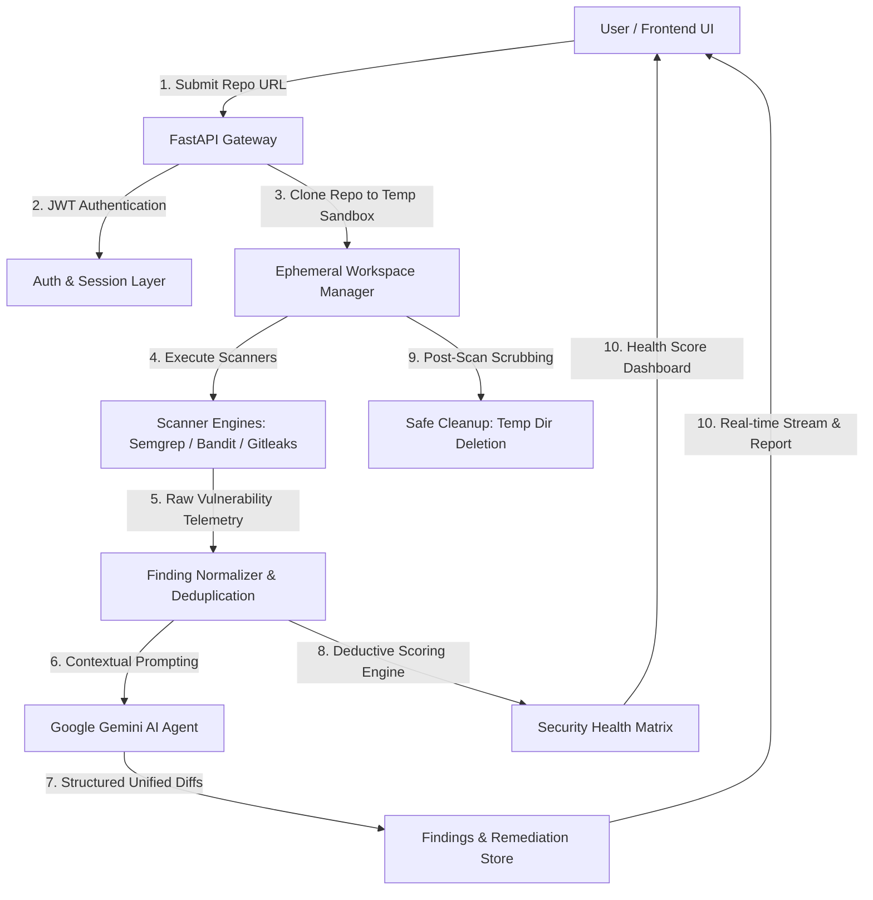

<div align="center">

# 🛡️ DevSec Agent
### *Autonomous Security Intelligence & AI-Powered Vulnerability Remediation*

[](https://fastapi.tiangolo.com)
[](https://reactjs.org/)
[](https://www.typescriptlang.org/)
[](https://tailwindcss.com/)
[](https://deepmind.google/technologies/gemini/)
[](https://opensource.org/licenses/MIT)

<p align="center">
  <b>Secure code before it ships.</b> An end-to-end security scanner that clones repositories into ephemeral sandboxes, runs multi-engine static analysis & secret discovery, computes a real-time deductive security score, and provides instant Gemini-driven automated patches.
</p>

</div>

---

## ✨ Key Features

- **🚀 Ephemeral Multi-Engine Scanning**:
  - **Semgrep**: Advanced Static Application Security Testing (SAST) for OWASP Top 10 vulnerabilities.
  - **Bandit**: Deep Python AST security analysis and unsafe method detection.
  - **Gitleaks**: High-entropy token, private key, and `.env` leak scanner.
- **🤖 Gemini AI Remediation Agent**:
  - Structured, context-aware code patches and unified diffs generated via Google Gemini.
  - Generates clear root cause explanations, risk severity breakdowns, and step-by-step fix guides.
- **📊 0–100 Deductive Security Health Score**:
  - Deterministic grading matrix evaluating critical, high, medium, and low severity issues along with secret exposure penalties.
- **🎯 Deployment Target Analysis**:
  - Environment-specific verification rules tailored for **Vercel**, **Netlify**, and **Render**.
- **💻 Interactive Cyber Terminal UI**:
  - Interactive WebGL fluid cursor background, real-time live terminal feed, repository file-tree navigator, and dark cyber-themed glassmorphism aesthetic.
- **🔒 Zero Source Code Retention**:
  - Sandboxed workspaces are automatically scrubbed and deleted immediately following scan execution.

---

## 🏗️ Architecture



---

## 📁 Repository Structure

```
DEVSEC-AGENT/
├── backend/
│   ├── app/
│   │   ├── api/
│   │   │   └── routes/          # Auth, Repositories, Scans, Findings, Dashboard
│   │   ├── auth/                # JWT Security, Password Hashing, Session Models
│   │   ├── database/            # SQLAlchemy Engine & Session Configuration
│   │   ├── scanner/             # Semgrep, Bandit, Gitleaks adapters
│   │   └── main.py              # FastAPI Application Entrypoint
│   ├── requirements.txt         # Backend Python Dependencies
│   └── alembic.ini              # Database Migration Configuration
├── frontend/
│   ├── src/
│   │   ├── components/          # CyberScanner, IntroHero, CuteLampAuth, Navbar, FileTree
│   │   ├── pages/               # Home, Dashboard, ScanProgress, FindingView, Login, Register
│   │   ├── App.tsx              # React Routing & Context Providers
│   │   └── main.tsx             # Frontend DOM Entrypoint
│   ├── package.json             # Vite, React & Tailwind Dependencies
│   ├── tailwind.config.js       # Cyber Design Tokens & Custom Themes
│   └── vite.config.ts           # Development Proxy & Build Configuration
├── docker-compose.yml           # Local PostgreSQL Container Setup
├── supabase_schema.sql          # Supabase / PostgreSQL Schema Definition
├── .env.example                 # Environment Variable Template
└── README.md                    # Project Documentation
```

---

## 🚀 Quick Start Guide

### Prerequisites
- **Node.js**: v18+ & `npm`
- **Python**: 3.10+
- **Docker** (optional, for local Postgres) or a **Supabase/PostgreSQL** instance
- **Git**

---

### 1. Database Setup

Start local PostgreSQL with Docker:
```bash
docker compose up -d
```
*Or use any PostgreSQL provider (Supabase / Neon / Render) and execute [`supabase_schema.sql`](./supabase_schema.sql).*

---

### 2. Backend Setup

```bash
cd backend

# Create and activate Python virtual environment
python -m venv .venv
# On Windows:
.venv\Scripts\activate
# On Linux/macOS:
source .venv/bin/activate

# Install dependencies
pip install -r requirements.txt

# Install core security scanner CLI tools (optional for live scans)
pip install semgrep bandit

# Copy environment configuration
cp ../.env.example .env
```

Configure `backend/.env`:
```env
DATABASE_URL=sqlite:///./devsecagent.db
JWT_SECRET=your_super_secret_jwt_key
GEMINI_API_KEY=your_gemini_api_key_here
CORS_ORIGINS=["http://localhost:5173","http://127.0.0.1:5173"]
```

Run the backend server:
```bash
uvicorn app.main:app --reload --host 0.0.0.0 --port 8000
```
API Documentation will be live at `http://localhost:8000/docs`.

---

### 3. Frontend Setup

```bash
cd frontend

# Install packages
npm install

# Start Vite development server
npm run dev
```
Open `http://localhost:5173` in your browser.

---

## 🌐 Deployment

### Frontend (Vercel)
1. Import repository on [Vercel](https://vercel.com).
2. Set Root Directory to `frontend`.
3. Set Build Command to `npm run build` and Output Directory to `dist`.
4. Configure environment variables (e.g., `VITE_API_URL` pointing to backend).

### Backend (Render / Railway / Fly.io)
1. Deploy `backend` as a Python Web Service.
2. Build Command: `pip install -r requirements.txt && pip install semgrep bandit`
3. Start Command: `uvicorn app.main:app --host 0.0.0.0 --port $PORT`
4. Supply environment variables (`DATABASE_URL`, `JWT_SECRET`, `GEMINI_API_KEY`, `CORS_ORIGINS`).

---

## 🛡️ Security Principles & Guardrails

- **Zero-Storage Sandboxing**: Repositories are cloned to isolated temporary directories with UUID namespacing and completely purged upon scan finalization.
- **Untrusted AI Output**: AI-generated remediation patches are presented as proposed unified diffs for human review.
- **Least-Privilege & Credential Isolation**: Sensitive secrets are strictly managed through server-side environment variables and never logged or leaked to client payloads.

---

## 📄 License

This project is licensed under the **MIT License**.
